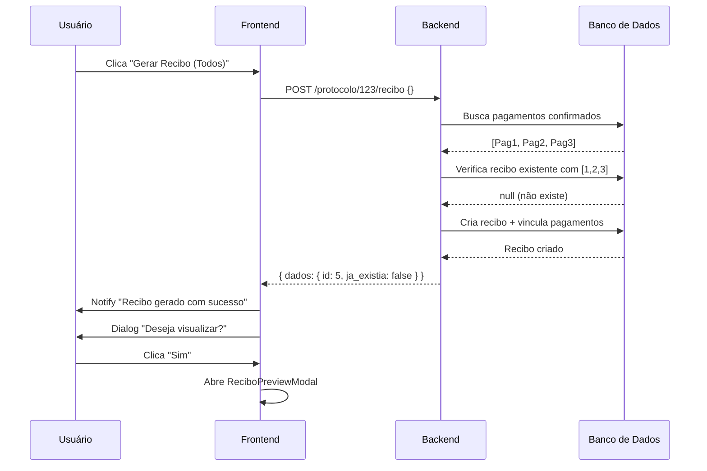
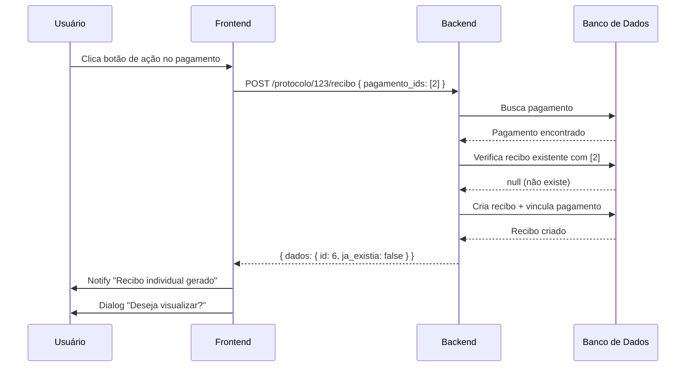
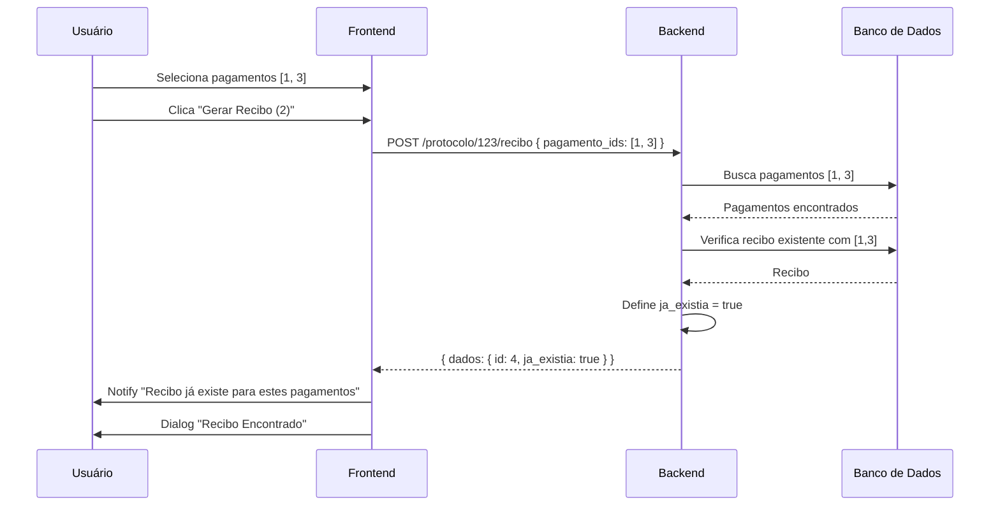

# Sistema de Recibos - Documentação Técnica

## 📋 Visão Geral

Sistema completo para geração e gestão de recibos vinculados a pagamentos de protocolos. Permite criar recibos individuais por pagamento ou agrupar múltiplos pagamentos em um único recibo, com verificação automática de duplicidade.

---

## 🗄️ Estrutura de Banco de Dados

### Tabela `recibo`

```sql
CREATE TABLE recibo (
    id BIGSERIAL PRIMARY KEY,
    empresa_id BIGINT NOT NULL,
    protocolo_id BIGINT NOT NULL,
    numero VARCHAR(20) UNIQUE NOT NULL,
    ano INTEGER NOT NULL,
    usuario_id BIGINT NOT NULL,
    solicitante_nome VARCHAR(255) NOT NULL,
    solicitante_cpf_cnpj VARCHAR(18),
    valor_total DECIMAL(15,2) NOT NULL,
    valor_isento DECIMAL(15,2) DEFAULT 0,
    valor_pago DECIMAL(15,2) NOT NULL,
    data_emissao TIMESTAMP NOT NULL,
    observacao TEXT,
    data_cadastro TIMESTAMP DEFAULT NOW(),
    data_alteracao TIMESTAMP DEFAULT NOW(),
    data_exclusao TIMESTAMP,

    FOREIGN KEY (empresa_id) REFERENCES empresa(id),
    FOREIGN KEY (protocolo_id) REFERENCES protocolo(id),
    FOREIGN KEY (usuario_id) REFERENCES usuario(id)
);
```

**Campos importantes:**
- `numero`: Formato `YYYY/RNNNNNN` (ex: `2026/R000001`)
- `valor_pago`: Soma dos pagamentos incluídos neste recibo
- `ja_existia`: Atributo virtual (não persiste no banco)

### Tabela `recibo_pagamento` (Pivot)

```sql
CREATE TABLE recibo_pagamento (
    recibo_id BIGINT NOT NULL,
    protocolo_pagamento_id BIGINT NOT NULL,
    valor DECIMAL(15,2) NOT NULL,

    PRIMARY KEY (recibo_id, protocolo_pagamento_id),
    FOREIGN KEY (recibo_id) REFERENCES recibo(id) ON DELETE CASCADE,
    FOREIGN KEY (protocolo_pagamento_id) REFERENCES protocolo_pagamento(id) ON DELETE CASCADE
);
```

**Propósito:**
- Rastreia quais pagamentos estão incluídos em cada recibo
- Permite verificar duplicidade de recibos
- Armazena o valor do pagamento no momento da emissão do recibo

---

## 🔧 Backend

### Models

#### `Recibo.php`

```php
<?php

namespace App\Models;

use App\Traits\Auditavel;
use App\Traits\PertenceEmpresa;
use Illuminate\Database\Eloquent\Model;
use Illuminate\Database\Eloquent\Relations\BelongsTo;
use Illuminate\Database\Eloquent\Relations\BelongsToMany;
use Illuminate\Database\Eloquent\SoftDeletes;

class Recibo extends Model
{
    use SoftDeletes, Auditavel, PertenceEmpresa;

    protected $table = 'recibo';

    const CREATED_AT = 'data_cadastro';
    const UPDATED_AT = 'data_alteracao';
    const DELETED_AT = 'data_exclusao';

    protected $fillable = [
        'empresa_id',
        'protocolo_id',
        'numero',
        'ano',
        'usuario_id',
        'solicitante_nome',
        'solicitante_cpf_cnpj',
        'valor_total',
        'valor_isento',
        'valor_pago',
        'data_emissao',
        'observacao',
    ];

    protected $appends = ['ja_existia'];

    // Relacionamentos
    public function protocolo(): BelongsTo
    {
        return $this->belongsTo(Protocolo::class);
    }

    public function usuario(): BelongsTo
    {
        return $this->belongsTo(User::class, 'usuario_id');
    }

    public function pagamentos(): BelongsToMany
    {
        return $this->belongsToMany(
            ProtocoloPagamento::class,
            'recibo_pagamento',
            'recibo_id',
            'protocolo_pagamento_id'
        )->withPivot('valor');
    }

    // Atributo virtual
    public function getJaExistiaAttribute(): bool
    {
        return $this->attributes['ja_existia'] ?? false;
    }

    // Helper para gerar número sequencial
    public static function gerarNumero(): string
    {
        $ano = now()->year;
        $ultimoNumero = DB::table('recibo')
            ->where('ano', $ano)
            ->max(DB::raw("CAST(SUBSTRING(numero FROM 7) AS INTEGER)"));
        $sequencial = ($ultimoNumero ?? 0) + 1;
        return sprintf('%d/R%06d', $ano, $sequencial);
    }
}
```

### Controllers

#### `ReciboController.php`

**Principais Métodos:**

```php
// GET /recibo - Listar recibos (com filtros e paginação)
public function listar(Request $request): JsonResponse

// GET /recibo/{id} - Buscar recibo específico
public function exibir(int $id): JsonResponse

// POST /protocolo/{id}/recibo - Gerar recibo
public function gerar(Request $request, int $id): JsonResponse

// GET /recibo/{id}/preview - Preview HTML
public function preview(int $id)

// GET /recibo/{id}/imprimir - Download PDF
public function imprimir(int $id): Response
```

**Parâmetros do método `gerar`:**

```json
{
  "pagamento_ids": [1, 2, 3]  // Opcional: IDs dos pagamentos a incluir
}
```

- Se `pagamento_ids` vazio ou ausente: usa todos os pagamentos confirmados
- Se informado: usa apenas os pagamentos especificados

### Services

#### `ReciboService.php`

**Método Principal: `gerar()`**

```php
public function gerar(Protocolo $protocolo, array $pagamentoIds = []): Recibo
```

**Fluxo:**

1. **Validação dos Pagamentos**
   - Se IDs específicos: busca apenas esses pagamentos
   - Se vazio: busca todos os pagamentos confirmados
   - Valida se existem pagamentos confirmados

2. **Verificação de Duplicidade**
   - Ordena IDs dos pagamentos
   - Busca recibo existente com exatamente os mesmos pagamentos
   - Se encontrar: retorna o recibo existente (com flag `ja_existia = true`)
   - Se não encontrar: continua para criar novo

3. **Criação do Recibo**
   - Gera número sequencial (`YYYY/RNNNNNN`)
   - Calcula `valor_pago` somando os pagamentos selecionados
   - Cria registro na tabela `recibo`
   - Vincula pagamentos na tabela pivot `recibo_pagamento`

**Exemplo de Verificação de Duplicidade:**

```php
// Busca recibos do protocolo que tenham todos os pagamentos
$reciboExistente = Recibo::where('protocolo_id', $protocolo->id)
    ->whereHas('pagamentos', function ($query) use ($pagamentoIdsOrdenados) {
        $query->whereIn('protocolo_pagamento.id', $pagamentoIdsOrdenados);
    }, '=', count($pagamentoIdsOrdenados))
    ->get()
    ->first(function ($recibo) use ($pagamentoIdsOrdenados) {
        $reciboPagamentoIds = $recibo->pagamentos->pluck('id')->sort()->values()->toArray();
        return $reciboPagamentoIds === $pagamentoIdsOrdenados;
    });
```

---

## 🎨 Frontend

### Componentes

#### 1. `ProtocoloFinanceiroTab.vue`

**Localização:** `frontend/src/components/protocolo/ProtocoloFinanceiroTab.vue`

**Funcionalidades:**

- Tabela de pagamentos com seleção múltipla (checkboxes)
- Botão global "Gerar Recibo" (mostra quantos selecionados)
- Botão individual por pagamento (coluna de ações)
- Modal de preview do recibo após geração

**Template - Botões:**

```vue
<div class="q-gutter-sm">
  <!-- Botão global (usa selecionados ou todos) -->
  <q-btn
    v-if="protocolo.valor_pago > 0"
    color="primary"
    icon="eva-printer-outline"
    :label="labelBotaoRecibo"
    @click="gerarRecibo"
  />

  <!-- Botão receber pagamento -->
  <q-btn
    v-if="valorRestante > 0"
    color="green"
    icon="add"
    label="Receber Pagamento"
    @click="abrirModalPagamento"
  />
</div>
```

**Template - Tabela com Seleção:**

```vue
<q-table
  :rows="protocolo.pagamentos"
  :columns="pagamentosColumns"
  row-key="id"
  selection="multiple"
  v-model:selected="pagamentosSelecionados"
>
  <!-- Coluna de ações com botão individual -->
  <template v-slot:body-cell-actions="props">
    <q-td :props="props">
      <q-btn
        v-if="props.row.status === 'confirmado'"
        flat round dense size="sm"
        icon="eva-printer-outline"
        color="primary"
        @click="gerarReciboIndividual(props.row)"
      >
        <q-tooltip>Gerar Recibo</q-tooltip>
      </q-btn>
      <!-- Outros botões de ação... -->
    </q-td>
  </template>
</q-table>
```

**Script - Funções Principais:**

```javascript
// Label dinâmico do botão
const labelBotaoRecibo = computed(() => {
  if (pagamentosSelecionados.value.length > 0) {
    return `Gerar Recibo (${pagamentosSelecionados.value.length})`
  }
  return 'Gerar Recibo (Todos)'
})

// Gerar recibo (múltiplos ou todos)
async function gerarRecibo() {
  const payload = {}
  if (pagamentosSelecionados.value.length > 0) {
    payload.pagamento_ids = pagamentosSelecionados.value.map(p => p.id)
  }

  const { data } = await api.post(`/protocolo/${protocolo.id}/recibo`, payload)

  if (data.sucesso) {
    const reciboJaExistia = data.dados.ja_existia

    $q.notify({
      type: 'positive',
      message: reciboJaExistia
        ? 'Recibo já existe para estes pagamentos'
        : 'Recibo gerado com sucesso'
    })

    // Dialog para visualizar
    $q.dialog({
      title: reciboJaExistia ? 'Recibo Encontrado' : 'Recibo Gerado',
      message: 'Deseja visualizar o recibo agora?',
      ok: { label: 'Sim, visualizar', color: 'primary' },
      cancel: { label: 'Não', flat: true }
    }).onOk(() => {
      reciboIdSelecionado.value = data.dados.id
      modalReciboPreview.value = true
    })
  }
}

// Gerar recibo individual
async function gerarReciboIndividual(pagamento) {
  const payload = { pagamento_ids: [pagamento.id] }
  // ... mesmo fluxo de gerarRecibo()
}
```

#### 2. `ReciboPreviewModal.vue`

**Localização:** `frontend/src/components/recibo/ReciboPreviewModal.vue`

**Propósito:** Modal para visualizar preview HTML do recibo

**Props:**
- `recibo-id`: ID do recibo a exibir
- `protocolo-id`: ID do protocolo (para carregamento completo)

**Template:**

```vue
<modal
  v-model="model"
  :titulo="`Preview do Recibo ${recibo?.numero || ''}`"
  tamanho="lg"
  no-padding
  cor-botao-fechar="white"
  cor-cabecalho="#1976d2"
  cor-titulo-cabecalho="text-white"
>
  <template #default>
    <div class="preview-container">
      <recibo-preview
        v-if="recibo && protocolo"
        :recibo="recibo"
        :protocolo="protocolo"
      />
    </div>
  </template>

  <template #rodape>
    <q-btn label="Fechar" flat @click="fechar" />
    <q-btn label="Imprimir" color="primary" icon="print" @click="imprimir" />
  </template>
</modal>
```

**Script - Carregamento Automático:**

```javascript
watch(model, (val) => {
  if (val && props.reciboId) {
    carregarDados()
  } else if (!val) {
    setTimeout(() => {
      recibo.value = null
      protocolo.value = null
    }, 300)
  }
})

async function carregarDados() {
  // Buscar dados do recibo
  const reciboResponse = await api.get(`/recibo/${props.reciboId}`)
  recibo.value = reciboResponse.data.dados

  // Buscar dados completos do protocolo
  const protocoloId = props.protocoloId || recibo.value.protocolo_id
  const protocoloResponse = await api.get(`/protocolo/${protocoloId}`)
  protocolo.value = protocoloResponse.data.dados
}
```

#### 3. `ReciboPreview.vue`

**Localização:** `frontend/src/components/recibo/ReciboPreview.vue`

**Propósito:** Renderização HTML do recibo (usada no modal e PDF)

**Estrutura:**

```vue
<div class="recibo-preview">
  <!-- Header -->
  <div class="recibo-header">
    <h1>RECIBO DE PAGAMENTO</h1>
    <div>Cartório de Registro</div>
  </div>

  <!-- Informações do Recibo -->
  <div class="recibo-info-box">
    <div>Número: {{ recibo.numero }}</div>
    <div>Data: {{ formatarDataHora(recibo.data_emissao) }}</div>
    <div>Protocolo: {{ protocolo.numero }}</div>
    <div>Solicitante: {{ recibo.solicitante_nome }}</div>
  </div>

  <!-- Mensagem "Recebi(emos) de..." -->
  <div class="recibo-mensagem">
    <p>
      Recebi(emos) de <strong>{{ recibo.solicitante_nome }}</strong>
      a quantia de <strong>{{ formatarDinheiro(recibo.valor_pago) }}</strong>
      referente aos serviços prestados conforme discriminado abaixo.
    </p>
  </div>

  <!-- Tabela de Atos -->
  <div class="recibo-section">
    <div class="section-title">Atos e Serviços Prestados</div>
    <table>
      <!-- Itens do protocolo -->
    </table>
  </div>

  <!-- Tabela de Pagamentos -->
  <div class="recibo-section">
    <div class="section-title">Formas de Pagamento Recebidas</div>
    <table>
      <!-- IMPORTANTE: Usa recibo.pagamentos, não protocolo.pagamentos -->
      <tr v-for="pagamento in recibo.pagamentos">
        <td>{{ formatarDataHora(pagamento.data_pagamento) }}</td>
        <td>{{ pagamento.formaPagamento?.nome }}</td>
        <td>{{ pagamento.meioPagamento?.nome }}</td>
        <td>{{ formatarDinheiro(pagamento.pivot?.valor || pagamento.valor) }}</td>
      </tr>
    </table>
  </div>

  <!-- Totais -->
  <div class="recibo-totais">
    <div>Valor Total: {{ formatarDinheiro(recibo.valor_total) }}</div>
    <div v-if="recibo.valor_isento > 0">
      Valor Isento: - {{ formatarDinheiro(recibo.valor_isento) }}
    </div>
    <div class="grand-total">
      VALOR PAGO: {{ formatarDinheiro(recibo.valor_pago) }}
    </div>
  </div>

  <!-- Rodapé e Assinatura -->
  <div class="recibo-footer">
    <p>Este recibo comprova o pagamento dos serviços acima discriminados.</p>
  </div>

  <div class="recibo-assinatura">
    <div class="assinatura-linha">Assinatura do Responsável</div>
  </div>
</div>
```

**Observação Importante:**
- Usar `recibo.pagamentos` (apenas os pagamentos incluídos neste recibo)
- NÃO usar `protocolo.pagamentos` (todos os pagamentos do protocolo)

#### 4. `ReciboListaPage.vue`

**Localização:** `frontend/src/pages/recibo/ReciboListaPage.vue`

**Propósito:** Página de listagem geral de todos os recibos

**Funcionalidades:**
- Filtros: número, data início, data fim
- Tabela paginada de recibos
- Botões de ação: Preview HTML, Download PDF, Ver Detalhes
- Link para o protocolo correspondente

---

## 🔄 Fluxo de Funcionamento

### Cenário 1: Gerar Recibo com Todos os Pagamentos



### Cenário 2: Gerar Recibo Individual



### Cenário 3: Recibo Já Existe



---

## 📝 Exemplos de Uso

### Exemplo 1: Protocolo com 3 Pagamentos

**Pagamentos do Protocolo:**
- Pagamento A: R$ 100,00
- Pagamento B: R$ 200,00
- Pagamento C: R$ 150,00

**Possibilidades de Recibos:**

| Ação | Pagamentos Incluídos | Valor do Recibo | Status |
|------|----------------------|-----------------|--------|
| Gerar Recibo (Todos) | A + B + C | R$ 450,00 | Novo |
| Gerar Recibo (Todos) novamente | A + B + C | R$ 450,00 | **Existente** |
| Botão individual no Pag A | A | R$ 100,00 | Novo |
| Selecionar B + C → Gerar | B + C | R$ 350,00 | Novo |
| Selecionar B + C → Gerar novamente | B + C | R$ 350,00 | **Existente** |

**Resultado Final:**
- 3 recibos únicos criados:
  - Recibo #1: R$ 450,00 (A+B+C)
  - Recibo #2: R$ 100,00 (A)
  - Recibo #3: R$ 350,00 (B+C)

### Exemplo 2: Workflow Típico

```javascript
// 1. Usuário registra pagamentos no protocolo
await api.post('/protocolo/123/pagamento', {
  valor: 150.00,
  forma_pagamento_id: 1,
  meio_pagamento_id: 1
})

// 2. Gera recibo individual
await api.post('/protocolo/123/recibo', {
  pagamento_ids: [456] // ID do pagamento registrado
})

// 3. Registra outro pagamento
await api.post('/protocolo/123/pagamento', {
  valor: 200.00,
  forma_pagamento_id: 2,
  meio_pagamento_id: 3
})

// 4. Gera recibo com ambos os pagamentos
await api.post('/protocolo/123/recibo', {
  pagamento_ids: [456, 789]
})
// Resultado: Cria NOVO recibo com R$ 350,00

// 5. Tenta gerar novamente
await api.post('/protocolo/123/recibo', {
  pagamento_ids: [456, 789]
})
// Resultado: Retorna o recibo existente (ja_existia: true)
```

---

## 🎯 Validações e Regras de Negócio

### Backend (ReciboService)

1. **Validação de Pagamentos Confirmados**
   ```php
   if ($pagamentos->isEmpty()) {
       throw ValidationException::withMessages([
           'pagamento_ids' => ['Nenhum pagamento confirmado encontrado.']
       ]);
   }
   ```

2. **Validação de Valor Mínimo**
   ```php
   if ($protocolo->valor_pago <= 0 && !$protocolo->eIsento()) {
       throw ValidationException::withMessages([
           'protocolo' => ['Protocolo não possui pagamentos confirmados nem isenção.']
       ]);
   }
   ```

3. **Verificação de Duplicidade**
   - Ordena IDs dos pagamentos para comparação consistente
   - Busca recibo com exatamente os mesmos pagamentos
   - Compara arrays ordenados para garantir match exato

### Frontend (ProtocoloFinanceiroTab)

1. **Botão "Gerar Recibo" só aparece se:**
   ```javascript
   v-if="protocolo.valor_pago > 0"
   ```

2. **Botão individual só aparece se:**
   ```javascript
   v-if="props.row.status === 'confirmado'"
   ```

3. **Validação antes de gerar:**
   ```javascript
   if (props.protocolo.valor_pago <= 0) {
     $q.notify({
       type: 'warning',
       message: 'Não há pagamentos confirmados para gerar recibo'
     })
     return
   }
   ```

---

## 🔐 Permissões

**Permissões relacionadas a recibos:**

- `RECIBO_LISTAR`: Ver lista de recibos
- `RECIBO_VISUALIZAR`: Ver detalhes/preview de recibo
- `RECIBO_GERAR`: Gerar novos recibos
- `RECIBO_IMPRIMIR`: Download de PDF

**Nota:** A geração de recibo está disponível na aba Financeiro do protocolo e requer permissão `PROTOCOLO_FINANCEIRO_VISUALIZAR` + `RECIBO_GERAR`.

---

## 📊 Auditoria

Todas as operações em recibos são auditadas:

- **Tabela:** `auditoria.registro`
- **Trigger:** Aplicado na tabela `recibo`
- **Ações auditadas:** INSERT, UPDATE, DELETE
- **Dados capturados:**
  - `usuario_id`: Quem realizou a ação
  - `ip_address`: IP de origem
  - `user_agent`: Navegador/cliente
  - `dados_antigos` / `dados_novos`: JSON com os valores

**Consultar auditoria de um recibo:**

```php
$recibo = Recibo::find(5);
$historico = $recibo->auditoria()->get();
```

---

## 🧪 Testes

### Cenários de Teste Sugeridos

1. **Teste de Criação de Recibo**
   - Criar protocolo com pagamentos
   - Gerar recibo
   - Verificar número sequencial
   - Verificar valor correto
   - Verificar vinculação na pivot

2. **Teste de Duplicidade**
   - Gerar recibo com pagamentos [1, 2]
   - Tentar gerar novamente com mesmos pagamentos
   - Verificar que retorna o mesmo recibo
   - Verificar flag `ja_existia = true`

3. **Teste de Recibos Diferentes**
   - Gerar recibo com [1, 2]
   - Gerar recibo com [1, 3]
   - Verificar que são recibos diferentes
   - Verificar numeração sequencial

4. **Teste de Validação**
   - Tentar gerar recibo sem pagamentos confirmados
   - Verificar exceção lançada
   - Tentar gerar com IDs inválidos
   - Verificar mensagem de erro

---

## 🐛 Troubleshooting

### Problema: Recibo não mostra todos os pagamentos

**Causa:** Componente usando `protocolo.pagamentos` ao invés de `recibo.pagamentos`

**Solução:**
```vue
<!-- ERRADO -->
<tr v-for="pagamento in protocolo.pagamentos">

<!-- CORRETO -->
<tr v-for="pagamento in recibo.pagamentos">
```

### Problema: Sempre cria novo recibo mesmo com pagamentos iguais

**Causa:** Erro na verificação de duplicidade

**Debug:**
```php
// Verificar se os IDs estão sendo ordenados
dd($pagamentoIdsOrdenados);

// Verificar se a query está encontrando recibos
dd(Recibo::where('protocolo_id', $protocolo->id)->get());
```

### Problema: Erro "pagamento_ids.*" na validação

**Causa:** IDs de pagamentos não existem ou não pertencem ao protocolo

**Solução:** Verificar se os pagamentos:
- Existem na tabela `protocolo_pagamento`
- Estão com `status = 'confirmado'`
- Pertencem ao protocolo correto

---

## 📚 Referências

- **Trait RespostaApi:** Retorna JSON em português (`{ sucesso, mensagem, dados }`)
- **Trait Auditavel:** Sistema de auditoria com triggers PostgreSQL
- **Trait PertenceEmpresa:** Multi-tenancy com `empresa_id`
- **Componente Modal:** Modal customizado do projeto (não usar q-dialog)
- **Eva Icons:** Biblioteca de ícones usada nas ações

---

## 🚀 Melhorias Futuras

1. **Envio de Recibo por E-mail**
   - Adicionar botão "Enviar por E-mail" no modal de preview
   - Implementar job assíncrono para envio

2. **Cancelamento de Recibo**
   - Adicionar botão de cancelamento (soft delete)
   - Registrar motivo do cancelamento
   - Gerar recibo substituto

3. **Impressão em Lote**
   - Selecionar múltiplos recibos na lista
   - Gerar PDF único com todos os recibos

4. **Assinatura Digital**
   - Integração com Lacuna/RestPKI
   - Adicionar QR Code ao recibo

5. **Exportação**
   - Exportar lista de recibos para Excel/CSV
   - Filtros avançados (por usuário, por período, etc.)

---

**Documentação criada em:** 2026-02-08
**Versão:** 1.0
**Autor:** Claude Sonnet 4.5
